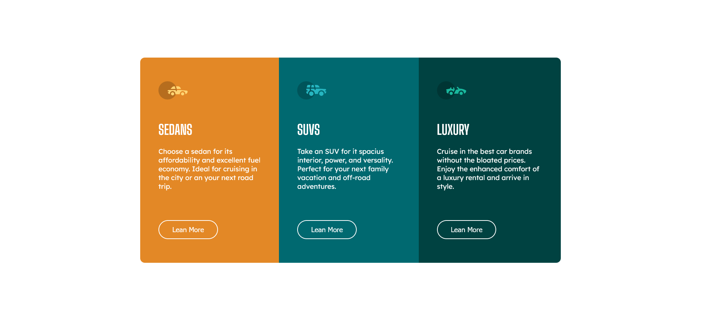

# Frontend Mentor - 3-column preview card component solution

This is a solution to the [3-column preview card component challenge on Frontend Mentor](https://www.frontendmentor.io/challenges/3column-preview-card-component-pH92eAR2-). Frontend Mentor challenges help you improve your coding skills by building realistic projects. 

## Table of contents

- [Overview](#overview)
  - [The challenge](#the-challenge)
  - [Screenshot](#screenshot)
  - [Links](#links)
- [My process](#my-process)
  - [Built with](#built-with)
- [Author](#author)

## Overview

### The challenge

Users should be able to:

- View the optimal layout depending on their device's screen size
- See hover states for interactive elements

### Screenshot

### Links

- [Solution URL](https://github.com/andre-silva96/HTML-5-e-CSS-3/tree/main/3-column-preview-card-component-main)
- [Live Site URL](https://andre-silva96.github.io/HTML-5-e-CSS-3/3-column-preview-card-component-main/index)

## My process

### Built with

- HTML5 with Semantic Tags
- CSS3 Properties
- Flexbox

## Author

- Frontend Mentor - [@andre-silva96](https://www.frontendmentor.io/profile/andre-silva96)
- LinkedIn - [André da Silva](https://www.linkedin.com/in/andresilva96/)
